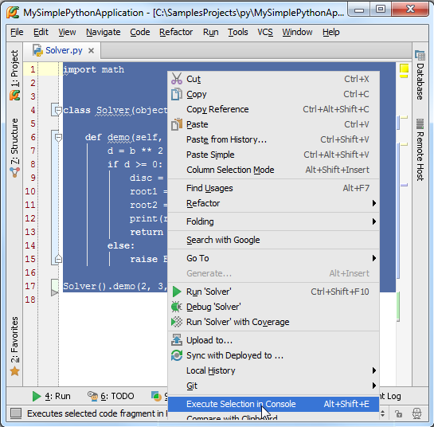
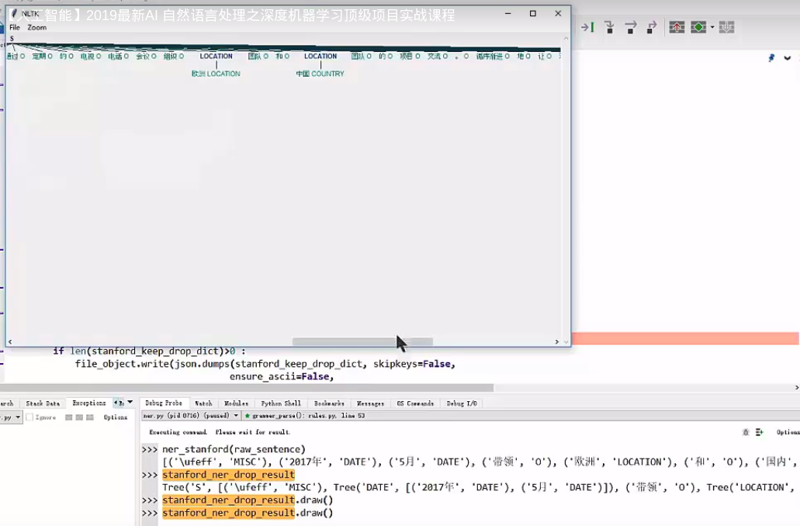

# 说明
主要使用Stanfordnlp进行命名实体识别


# 其他：
# 1.断点调试：
复制选中代码片段，右击在弹出的快捷菜单中选择Execute Selection in Console



就可以在console里单独运行了
```
stanford_ner_drop_result = stanford_ner_drop_rp.parse(ner_stanford(raw_sentence) )
stanford_ner_drop_result
Tree('S', [('\ufeff', 'MISC'), Tree('DATE', [('2017年', 'DATE'), ('5月', 'DATE')]), ('带领', 'O'), Tree('LOCATION', [('欧洲', 'LOCATION')]), ('和', 'O'), ('国内', 'O'), ('的', 'O'), ('双边', 'O'), ('项目', 'O'), ('团队', 'O'), ('在', 'O'), ('国外', 'O'), ('工厂', 'O'), ('和', 'O'), ('本土', 'O'), ('工厂', 'O'), ('间', 'O'), ('进行', 'O'), ('新', 'O'), ('产品', 'O'), ('和', 'O'), ('模具', 'O'), ('项目', 'O'), ('的', 'O'), ('国际', 'O'), ('转移', 'O'), ('。', 'O'), ('搭建', 'O'), ('外国人', 'O'), ('成员', 'O'), ('和', 'O'), ('中国人', 'DEMONYM'), ('成员', 'O'), ('间', 'O'), ('的', 'O'), ('沟通', 'O'), ('平台', 'O'), ('，', 'O'), ('通过', 'O'), ('定期', 'O'), ('的', 'O'), ('电视', 'O'), ('电话', 'O'), ('会议', 'O'), ('组织', 'O'), Tree('LOCATION', [('欧洲', 'LOCATION')]), ('团队', 'O'), ('和', 'O'), Tree('LOCATION', [('中国', 'COUNTRY')]), ('团队', 'O'), ('的', 'O'), ('项目', 'O'), ('交流', 'O'), ('。', 'O'), ('循序渐进', 'O'), ('地', 'O'), ('让', 'O'), ('双方', 'O'), ('理解', 'O'), ('不同', 'O'), ('国家', 'O'), ('间', 'O'), ('的', 'O'), ('文化', 'O'), ('差异', 'O'), ('，', 'O'), ('从而', 'O'), ('在', 'O'), ('推进', 'O'), ('项目', 'O'), ('的', 'O'), ('节奏', 'O'), ('上', 'O'), ('取得', 'O'), ('同步', 'O'), ('。', 'O')])

```

# 2.nltk的画依赖树功能
```python
stanford_ner_drop_result.draw()

```

